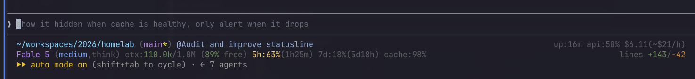

<div align="center">

# agent-statusline

**A three-row statusline for agentic coding CLIs — currently [Claude Code](https://claude.com/claude-code) — that turns the empty status slot into a live cockpit: repo state, PR/CI, cost, rate limits, and project health, at zero token cost.**

[](https://github.com/poudelprakash/agent-statusline/releases)
[](https://github.com/poudelprakash/agent-statusline/actions/workflows/shellcheck.yml)
[](LICENSE)
[](#)



</div>

Row 3 — project state (GSD phase, OpenSpec proposals, [Beads](https://github.com/steveyegge/beads) issues) — only renders when there's actually something to show; the screenshot above is a plain repo, so it's absent.

## Contents

- [Features](#features)
- [Why](#why)
- [Quickstart](#quickstart)
- [Structure](#structure)
- [Install](#install)
- [Making it yours](#making-it-yours)
- [Debugging](#debugging)
- [Compatibility](#compatibility)
- [Releases](#releases)
- [License](#license)

## Features

- **Repo/branch state** — dirty marker, ahead/behind, clickable branch link to GitHub
- **Open PR + CI** — review-state icon, cached `gh pr checks` rollup, clickable link to the PR
- **Session cost & duration** — tiered cost color, burn rate ($/h), API busy-ratio (working vs. idle)
- **Context budget** — used/window with free%, threshold-colored
- **Rate-limit pacing** — not just usage%, but whether you're on track to hit the cap before it resets
- **Prompt-cache health** — hit rate of the last request, colored
- **Live project-state row** — GSD phase, OpenSpec proposal counts, Beads issue counts, read off disk and cached
- **Fork-count discipline** — one `jq` call, one `git status` call; every render stays well under 20ms

## Why

Claude Code ships the statusline slot empty and pipes a JSON payload to whatever command you configure — model, token usage, cost, context window, rate limits, PR/git state. It costs zero tokens (the model never sees it) and near-zero render time if you're careful about forks. Left blank, all of that is wasted.

Design writeup: [Your Statusline Is the Cheapest Feedback Loop in Agentic Coding](https://www.sharmaprakash.com.np/blog/statusline-the-five-second-feedback-loop/) and the follow-up, [Statusline v2: Three Rows, Clickable Links, and a Live Project HUD](https://www.sharmaprakash.com.np/blog/statusline-v2-three-rows-live-project-hud/).

## Compatibility

| CLI | Status |
|---|---|
| [Claude Code](https://claude.com/claude-code) | ✅ Supported — this is what `lib/99-main.sh` parses today. |
| [Codex CLI](https://github.com/openai/codex) | ❌ Not yet possible. Codex's `tui.status_line` config only reorders built-in items — there's no external-command hook to plug into. A command-backed statusline modeled on Claude Code's is requested in [openai/codex#17827](https://github.com/openai/codex/issues/17827) but not shipped as of this writing. |
| Others | Untested. If your CLI pipes a JSON payload to a configurable statusline command, most of `lib/` (formatting, git, rate-limit pacing, project state) is reusable — only `lib/99-main.sh`'s `jq` field paths are Claude-Code-specific. |

This repo is named `agent-statusline`, not `claude-code-statusline`, so it doesn't need a rename if/when Codex (or another CLI) adds an equivalent hook — a Codex-specific parser module would live alongside `99-main.sh`, not replace it.

## Quickstart

Grab the prebuilt script straight from the [latest release](https://github.com/poudelprakash/agent-statusline/releases/latest) — no clone, no build step:

```bash
curl -fsSL https://github.com/poudelprakash/agent-statusline/releases/latest/download/statusline-command.sh \
  -o ~/.claude/statusline-command.sh
chmod +x ~/.claude/statusline-command.sh
```

Or clone and build it yourself if you plan to customize [row 3](#making-it-yours):

```bash
git clone https://github.com/poudelprakash/agent-statusline.git
cd agent-statusline
./build.sh   # writes ~/.claude/statusline-command.sh
```

Either way, add the `statusLine` block from [Install](#install) to `~/.claude/settings.json` and open a new Claude Code session.

## Structure

```
lib/
  00-colors.sh          base + 256-color identity palette
  01-format.sh           humanize/span/countdown/link/row_print helpers
  02-git.sh               branch + dirty/ahead-behind, one git call
  03-rate-limits.sh       pacing-aware rate-limit segments
  04-pr-ci.sh             PR review state + cached CI rollup
  05-project-state.sh     GSD / OpenSpec / Beads (row 3)
  06-model.sh             model badge with effort/fast/think qualifiers
  99-main.sh              composition root — parses the payload, renders rows
build.sh                  flattens lib/*.sh into one generated, fork-free script
```

`lib/` is the source of truth you edit. `build.sh` concatenates every module in order into a single generated file with **zero `source` calls at runtime** — sourcing doesn't fork, but it still costs a disk read per file, and this statusline re-renders on nearly every keystroke. Flattening at build time keeps editability without paying that cost on every render. Benchmarked: the generated single file performs identically (median/min render time) to a hand-written single-file version; a live `source`-per-module version measured ~5ms slower per render.

Each module is independently ShellCheck-clean. The composition root (`99-main.sh`) intentionally skips `set -euo pipefail`'s `errexit`/`nounset` — this script runs on every keystroke, and a hard failure from one flaky `git`/`jq`/`bd` call would blank the entire statusline instead of degrading gracefully. It relies on `2>/dev/null` and `${var:-0}`-style fallbacks instead.

## Install

Requires `bash`, `jq`, and `git`. `gh` (GitHub CLI) is optional, for the PR/CI row; `bd` ([Beads](https://github.com/steveyegge/beads)) is optional, for the Beads segment of row 3.

```bash
git clone https://github.com/poudelprakash/agent-statusline.git
cd agent-statusline
./build.sh
```

That writes `~/.claude/statusline-command.sh` (pass a different path as `$1` to build.sh if you want it elsewhere). Then point Claude Code at it in `~/.claude/settings.json`:

```jsonc
{
  "statusLine": {
    "type": "command",
    "command": "bash ~/.claude/statusline-command.sh",
    "refreshInterval": 5
  }
}
```

Open a new Claude Code session in any git repo to see it render. `refreshInterval` makes rows with live state (rate-limit countdowns, CI status) re-render on a timer, not just on keystrokes.

## Making it yours

Row 3 is the part least likely to transfer as-is — `sl_proj_gsd`, `sl_proj_openspec`, and `sl_proj_beads` in `lib/05-project-state.sh` read tools specific to my workflow. The pattern is what's reusable: read a project file or run a project CLI, cache the result if it's expensive, render it only when it has something to say. Swap in your own tracker (Jira, Linear, a plain `git log --since=yesterday`) following the same shape.

After editing anything under `lib/`, re-run `./build.sh` to regenerate the deployed script.

## Debugging

Every render writes the raw JSON payload Claude Code sent to `~/.cache/claude-statusline/last-input.json`, overwritten each time. When Claude Code ships a new payload field, `cat ~/.cache/claude-statusline/last-input.json | jq` shows you what's actually there instead of guessing from docs.

## Releases

Version history is in [CHANGELOG.md](CHANGELOG.md); the tag/build/publish process is documented in [RELEASE.md](RELEASE.md).

## License

MIT — see [LICENSE](LICENSE).
